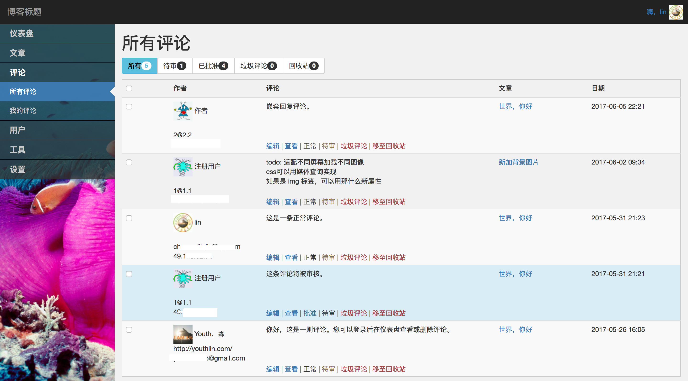
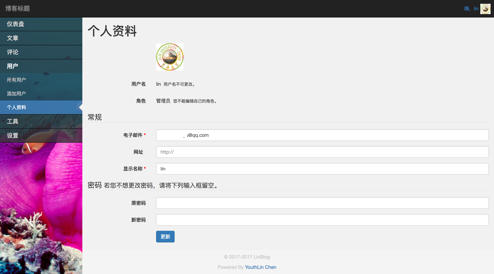

# 基于 SSM 框架的博客系统的设计与实现
# The Design and Implementation of a Blog System based on SSM Framework

https://github.com/YouthLin/lin-blog

## ScreenShots
Site Front  
Home：  

Post Page:  

Dashboard  
Overview:  

All Post:  

Write Post:  

Category:  

All Comments:  

Profile:  

#### License
MIT
